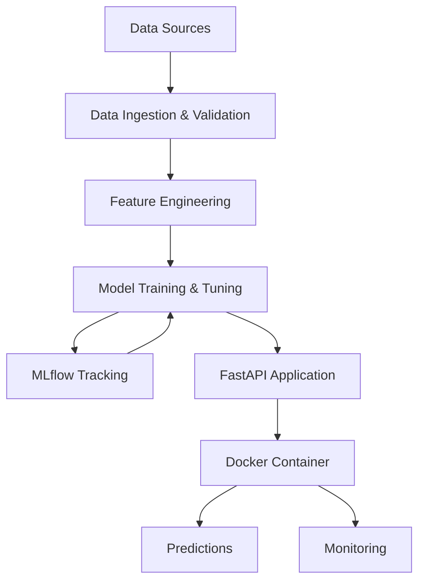
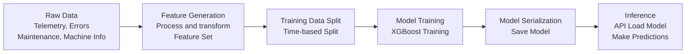
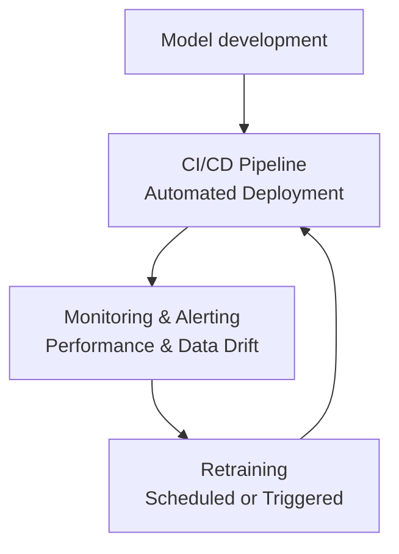

# Technical Design 
## 1. Introduction
This document outlines the technical design and architecture of the solution. The system is designed to be a robust, scalable, and maintainable platform for training, deploying, and monitoring a machine failure prediction model.
## 2. System Architecture
The architecture is designed following modern MLOps principles, separating concerns into distinct components that can be developed, tested, and deployed independently.
### 2.1. High-Level Architecture Diagram
The following diagram illustrates the key components, from data ingestion to model deployment and monitoring.

### 2.2. Component Descriptions
-   Data Ingestion and validation: Loads data from raw CSV files. In a production scenario, this component could connect to data streams or databases. Its necessary only if you want to retrain frequently the model.
-   Feature Engineering: Transforms raw data into meaningful features for the model. 
-   Model Training: Trains the machine learning model (XGBoost) using the calculated features.
-   Model Evaluation: Evaluates the trained model on a hold-out test set using various metrics (Precision, Recall, F1-score, AUC). 
-   MLflow Tracking Server: Logs all experiments, including parameters, metrics, and model artifacts. This makes it easy to compare different model versions.
-   Docker Container: The entire application, including the FastAPI server and the trained model, is packaged into a Docker container for portability and consistent deployment.
-   FastAPI Application: An api to generate model's predictions.
-   Prediction Service: The core of the API, which loads the trained model and uses it to make predictions on new data.
-   Monitoring Dashboard: (OPTIONAL future implementation) A dashboard to monitor the model's performance in production, track data drift, and alert for anomalies.

## 3. Data Flow
1.  Raw Data: The pipeline starts with the raw data sources: telemetry, errors, maintenance, and machine information.
2.  Feature Generation: The raw data is processed to create a single feature set (in this case using aggregation over time windows). The resulting features are stored for faster access during training and inference.
3.  Training Data Split: The feature set is split into training and testing sets based on a time-based cutoff. A random split would introduce noise given that the information of certain machines could not be on the same data split.
4.  Model Training: The training set is used to train the model. 
5.  Model Serialization: The trained model is serialized (using joblib) and saved.
6.  Inference: The API loads the saved model. When a prediction request is received, the API preprocesses the input data and returns the prediction.

## 4. MLOps Lifecycle
While not fully implemented, the project is designed with a full MLOps lifecycle in mind. Here is the envisioned workflow:
1.  Development: Data scientists explore data, develop new features, and experiment with different models in a development environment. Code is managed in a Git repository.
2.  CI/CD Pipeline (Continuous Integration/Continuous Deployment):
    -   When a change is pushed, a CI pipeline is triggered.
    -   Training Pipeline: The full training pipeline is executed to produce a new model candidate.
    -   Model Evaluation: The new model is evaluated against a baseline. If it performs better, it is promoted.
    -   Model Versioning: The new model is versioned and registered in MLflow.
    -   Deployment: The new Docker image (with the updated model) is deployed to a QA environment for further testing. After validation, it can be promoted to production.
3.  Monitoring & Alerting:
    -   Data Drift: Production data is monitored to detect drifts in the feature distribution.
    -   Model Performance: The model's predictive performance is continuously monitored.
    -   Alerts: If performance degrades or data drifts significantly, alerts are sent to the team.
4.  Retraining:
    -   Retraining can be triggered on a fixed schedule (e.g., monthly) or when monitoring detects a drop in performance.

## 5. Deployment Considerations
### 5.1. Docker Configuration
-   Port: The application runs on port 8000 inside the container. This can be mapped to any host port in the docker-compose.yml file. For example, to expose the service on port 8080 on the host, change the ports section to - "8080:8000".

### 5.2. Production Enhancements
In a real-world production environment, several improvements can be applied such as:
-   Authentication: The API is currently open. In production, an authentication layer (with tokens or keys) should be added to secure the endpoints.
-   Nginx Reverse Proxy: For handling SSL termination, load balancing, and serving static files, it's recommended to place the application behind a reverse proxy like Nginx.
-   Scalability: For high-traffic scenarios, the application can be scaled horizontally by running multiple Docker containers managed by an orchestrator like Kubernetes.