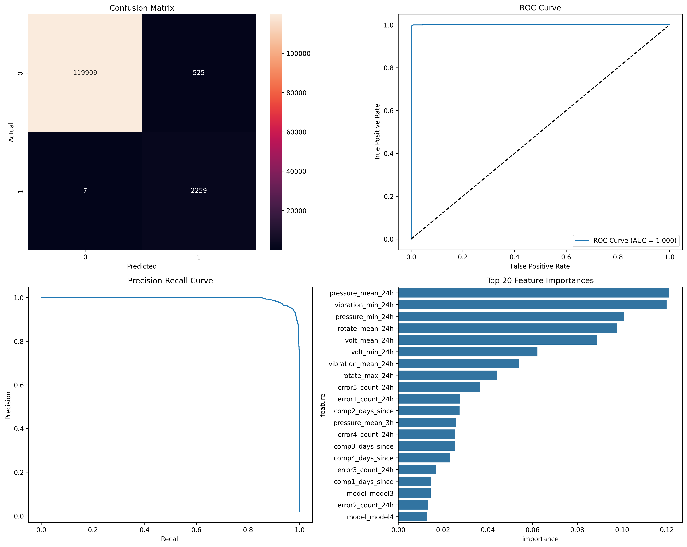

# Technical Report

This report summarizes the key results and considerations for the predictive maintenance project.

## 1. Project Goal

The objective is to predict machine failures within a 24 hour window (as the problem was not strictly defined, I chose this approach) using sensor telemetry and historical data. This enables proactive maintenance, reducing downtime and costs.

## 2. Solution Overview

An end-to-end machine learning pipeline using Python, XGBoost, and FastAPI.

- **Data Processing**: Raw telemetry, error, maintenance, and machine data are transformed into a feature set suitable for training.
- **Feature Engineering**: I created time-based features, such as rolling averages of sensor data (e.g., `volt_mean_24h`) and time since last event (e.g., `comp1_days_since`).
- **Modeling**: An XGBoost classifier is trained to solve the binary classification problem (failure vs. no failure). The model is trained on a temporal split of the data to prevent related information loss.
- **Deployment**: The trained model is served via a REST API using FastAPI for real-time predictions.
- **MLOps**: MLflow for experiment tracking and versioning is configured.

## 3. Model Performance

The model was trained on historical data and evaluated on a hold-out test set. The results are strong, demonstrating the model's ability to accurately predict failures
under the time window configured.

### Key Metrics

| Metric    | Score | Description                                                |
| :-------- |:------|:-----------------------------------------------------------|
| **AUC**   | 0.999 | Excellent class separation.                                |
| **F1-Score**    | 0.894 | Balance between Precision and Recall.                      |
| **Recall**| 0.997 | Successfully identifies 99.7% of all true failures.        |
| **Precision**| 0.811 | When it predicts a failure, it is correct 81% of the time. |

### Evaluation Plots

The following plots provide a comprehensive view of the model's performance on the test set.

- **Confusion Matrix**: Shows a high number of true positives and true negatives, with very few errors. It correctly identified almost all actual failures (only 7 were missed).
- **ROC Curve**: The AUC of nearly 1.0 indicates near-perfect classification ability.
- **Precision-Recall Curve**: The curve stays high, confirming that the model maintains high precision as recall increases.
- **Feature Importance**: `pressure_mean_24h` and `vibration_min_24h` are the most influential features for predicting failures.

## 4. Key Decisions & Trade-offs

- **Algorithm & Simplicity**: I chose **XGBoost** for its high performance on tabular data, speed, and built-in feature importance. 

- **Temporal Data Splitting**: To prevent data leakage, the data was split into training and testing sets based on dates, not randomly. This is a critical to ensure that the model is validated on data that is "in the future" relative to the training data, providing a realistic performance estimate.

- **Configurable Feature Windows**: As the problem was not strictly defined, I decided to engineer features using 3-hour and 24-hour time windows. These windows are designed to be easily configurable, allowing them to be adjusted based on business needs.

- **Validation Strategy**: A simple train/test split was used since I did not perform an exhaustive hyperparameter search. If more extensive hyperparameter tuning were needed, I would adopt a train/validation/test split. This would allow for tuning on the validation set while keeping the test set exclusively for final, unbiased performance evaluation.

## 5. Lessons Learned

- **Importance of Feature Engineering**: The performance of the model is heavily dependent on the quality of the engineered features. Time-based aggregations were critical for capturing the system's state before a failure.
- **Temporal Validation**: Ensuring that the validation respects the temporal order of the data is fundamental for obtaining a realistic estimate of future performance.
- **Model Simplicity**: By choosing a well-understood model I was able to deliver a robust, end-to-end solution quickly. 
- **Configuration in parameters**: Keeping parameters like feature windows in a configuration file (`config.yaml`) makes the pipeline more flexible and easier to adapt without hard code changes.

## 6. Next Steps

The current solution provides a foundation. The following steps focus on maturing the system according to MLOps best practices to ensure its long-term reliability in a production environment.

- **Automated Continuous Integration & Deployment (CI/CD)**: Implement a CI/CD pipeline to automate testing, model retraining, and deployment. 

- **Production monitoring**:
    - **Model performance**: Implement tracking over time of key metrics like precision and recall.
    - **Data drift**: Set up monitoring to detect changes in the input data distribution (data drift).

- **Automated retraining**: Establish a pipeline for automatically retraining the model on new data. This can be triggered on a fixed schedule or by alerts from the monitoring system.

- **A/B testing**: Before publishing a new model, implement an A/B testing to compare its performance against the currently deployed version. To ensure performance on real-time new data.